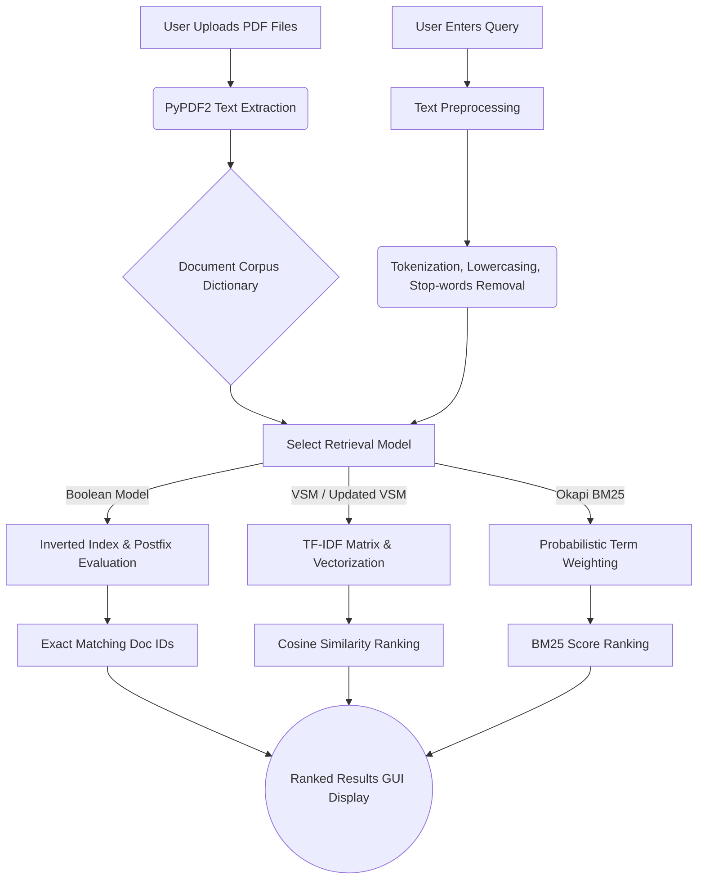

# 🔍 Multi-Model Information Retrieval Engine

An advanced, offline desktop application built with Python and Tkinter for extracting, processing, and retrieving information from PDF documents. This system implements multiple foundational Information Retrieval (IR) algorithms to rank and fetch the most relevant documents based on user queries.

---

## ✨ Key Features

* **PDF Parsing Engine:** Dynamically load, read, and extract text from multiple `.pdf` files locally using `PyPDF2`.
* **Multi-Model Search:** Choose between four distinct retrieval algorithms based on your precision requirements:
    1.  **Boolean Retrieval Model:** Evaluates exact logical queries using Postfix notation (`AND`, `OR`, `NOT`).
    2.  **Vector Space Model (VSM):** Ranks documents using TF-IDF and Cosine Similarity.
    3.  **Updated Vector Space Model:** An optimized or variant implementation of the standard VSM.
    4.  **Okapi BM25 Model:** A state-of-the-art probabilistic retrieval model with adjustable tuning parameters ($k_1$ and $b$).
* **Interactive GUI:** A clean, responsive desktop interface built with `tkinter` and `ttk` themes.
* **Dynamic Parameter Tuning:** Adjust the $k_1$ parameter directly from the GUI when using the BM25 model.

---

## 🏗️ System Architecture & Workflow

The following flowchart illustrates the internal pipeline of the system, from document ingestion to the final ranked output.

## 🧮 Mathematical Foundation

The retrieval engine combines **Machine Learning Classification** with the **Vector Space Model (VSM)** to provide efficient and context-aware search.

### 1. TF-IDF Representation

Both documents and user queries are transformed into numerical vectors using **Term Frequency-Inverse Document Frequency (TF-IDF)**.

The inverse document frequency of a term is defined as:

$$
IDF(t)=\log\left(\frac{N}{df_t}\right)
$$

Where:

* $N$ = Total number of documents.
* $df_t$ = Number of documents containing term $t$.

This weighting scheme increases the importance of informative terms while reducing the impact of common words.

---

### 2. Intent Classification (LinearSVC)

The system employs a **Linear Support Vector Classifier (LinearSVC)** to predict the most relevant domain for a given query.

Instead of searching the entire corpus, the classifier first assigns the query to one of the predefined categories:

* Technology
* Health
* Education
* Politics
* Sports

This significantly reduces the search space and improves retrieval precision.

---

### 3. Vector Space Similarity

After the category is predicted, the query is compared only with documents belonging to that category using **Cosine Similarity**.

The similarity score between a query $Q$ and a document $D$ is computed as:

$$
\text{Cosine Similarity}(Q,D)=
\frac{Q \cdot D}
{|Q||D|}
$$

Where:

* $Q \cdot D$ is the dot product between vectors.
* $|Q|$ and $|D|$ are the vector magnitudes.

Documents are then ranked according to their similarity scores, and the most relevant results are returned to the user.

---

### 🎯 Why This Hybrid Approach?

Traditional retrieval systems compute similarity against the entire document collection.

This project introduces a two-stage retrieval strategy:

1. **Intent Detection (LinearSVC)** narrows the search scope.
2. **Localized VSM Search** ranks documents only within the predicted category.

As a result, the system achieves:

* Reduced computational cost.
* Smaller search space.
* Better contextual relevance.
* Faster retrieval performance.

nltk.download('stopwords')
Run the Application:Bashpython gui/app.py
🕹️ How to UseClick 📌 Attach PDF files and select one or multiple PDF documents from your machine.Verify the loaded documents in the left content pane.Enter your search terms in the Search Query field.Select your preferred Recovery Model from the dropdown menu.Note: If BM25 is selected, an additional input field will appear allowing you to tune the $k_1$ parameter (between 1.2 and 2.0).Click 🔍 Search to view the ranked results and their corresponding scores in the bottom pane.
